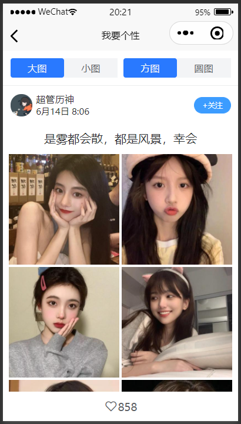
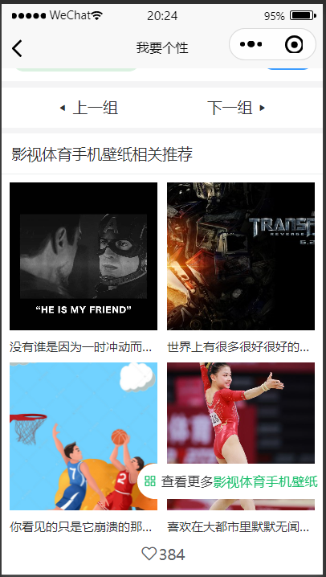
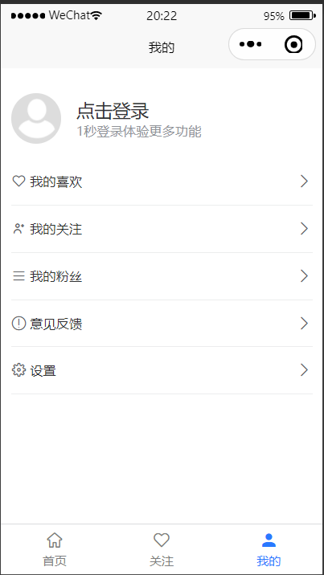
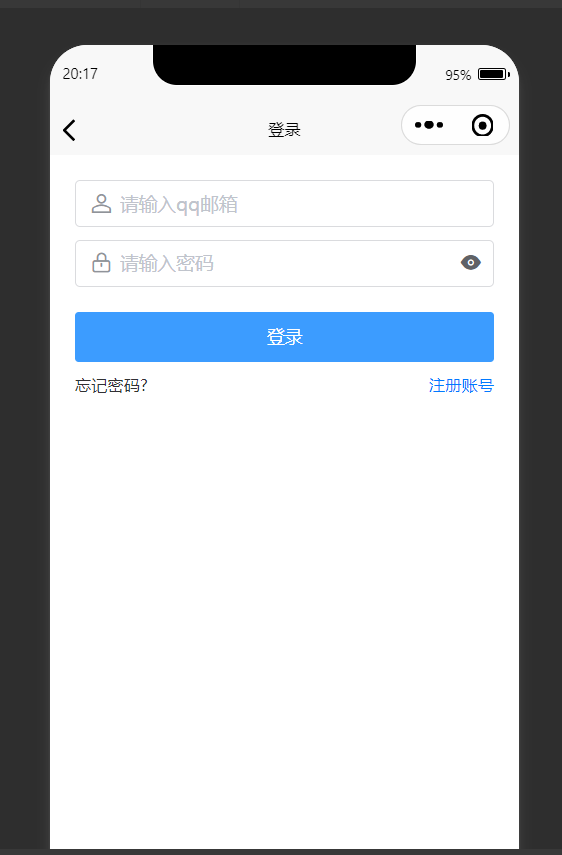
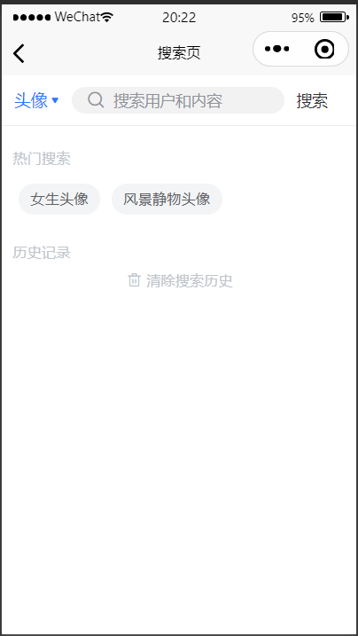
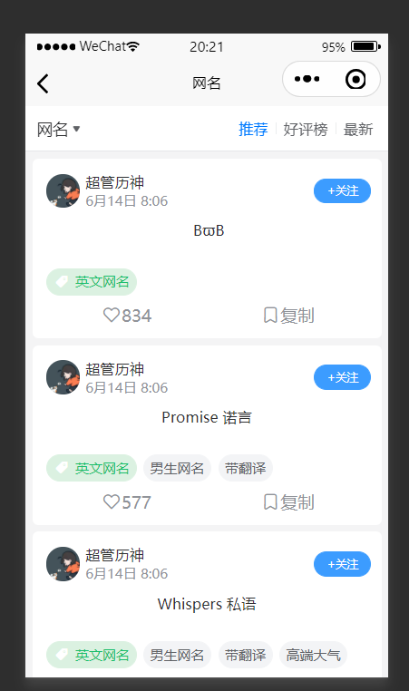

# uniapp-wygx-wxXcx
一个使用uniapp开发的微信小程序  
前端使用uniapp+uView组件库+vuex管理状态  
后台使用express框架+mongodb数据库,使用request模块爬取网站图片数据  
首页  

  

图片详情页  

  
推荐页  

  

用户页面  

   

登录页  

  

搜索页  

  

个性网名  

  
